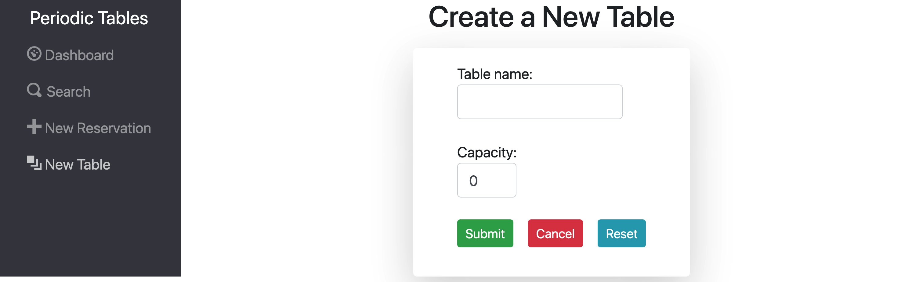

# Capstone: PERIODIC TABLES Restaurant Reservation System

(Link to live application coming soon!)

> I have been hired as a full stack developer at _Periodic Tables_, a startup that is creating a reservation system for fine dining restaurants.
> The software is used only by restaurant personnel when a customer calls to request a reservation.
> At this point, the customers will not access the system online.

## API Documentation:

| Route                               | Method | Status Code |  Description                                                        |
| ----------------------------------- | ------ | ----------- | ------------------------------------------------------------------- |
| /reservations                       | GET    | 200         | Returns a list of reservations for the current data                 |
| /reservations?date=####-##-##       | GET    | 200         | Returns a list of reservations for the given data                   |
| /reservations                       | POST   | 201         | Creates a new reservation                                           |
| /reservations/:reservation_id       | GET    | 200         | Returns the reservation for the given ID                            |
| /reservations/:reservation_id       | PUT    | 200         | Updates the reservation for the given ID                            |
| /reservations/:resevation_id/status | PUT    | 200         | Updates the status of the reservation for the given ID              | 
| /tables                             | GET    | 200         | Returns a list of tables                                            | 
| /tables                             | POST   | 201         | Create a new table                                                  | 
| /tables/:table_id                   | GET    | 200         | Returns the table for the given ID                                  | 
| /tables/:table_id/seat              | PUT    | 200         | Seats a resevation at the given table_id                            | 
| /tables/:table_id/seat              | DELETE | 200         | Changes the occupied status to be unoccupied for the given table_id |           

------------------------------------------------------------------------------------------------------------------------------------

## Screenshots

### Dashboard With Reservation For Current Day

### Dashboard With No Reservations For Current Day

### Search Page

### New Reservation Page

### New Table Page

### Tests Passing Internal Standards


## SUMMARY

### US-01 Create and list reservations

As a restaurant manager<br/>
I want to create a new reservation when a customer calls<br/>
so that I know how many customers will arrive at the restaurant on a given day.

### US-02 Create reservation on a future, working date

As a restaurant manager<br/>
I only want to allow reservations to be created on a day when we are open<br/>
so that users do not accidentally create a reservation for days when we are closed.<br/>

### US-03 Create reservation within eligible timeframe

As a restaurant manager<br/>
I only want to allow reservations to be created during business hours, up to 60 minutes before closing<br/>
so that users do not accidentally create a reservation for a time we cannot accommodate.

### US-04 Seat reservation

As a restaurant manager, <br/>
When a customer with an existing reservation arrives at the restaurant<br/>
I want to seat (assign) their reservation to a specific table<br/>
so that I know which tables are occupied and free.

### US-05 Finish an occupied table

As a restaurant manager<br/>
I want to free up an occupied table when the guests leave<br/>
so that I can seat new guests at that table.<br/>

### US-06 Reservation Status

As a restaurant manager<br/>
I want a reservation to have a status of either booked, seated, or finished<br/>
so that I can see which reservation parties are seated, and finished reservations are hidden from the dashboard.

### US-07 Search for a reservation by phone number

As a restaurant manager<br/>
I want to search for a reservation by phone number (partial or complete)<br/>
so that I can quickly access a customer's reservation when they call about their reservation.<br/>

### US-08 Change an existing reservation

As a restaurant manager<br/>
I want to be able to modify a reservation if a customer calls to change or cancel their reservation<br/>
so that reservations are accurate and current.

## Tech Stack

JavaScript, React, Express, Node, PostgreSQL, KnexJS, HTML, CSS, and BootStrap.

## Installation Instructions:

Install dependencies in terminal with

```js
npm install
```

Start server 

```js
npm start
```

Lastly you will create a database to store all the reservation data. This will require a .env file:

```js
// back-end .env example -> Connects to database
DATABASE_URL=enter-your-production-database-url-here
DATABASE_URL_DEVELOPMENT=enter-your-development-database-url-here
DATABASE_URL_TEST=enter-your-test-database-url-here
DATABASE_URL_PREVIEW=enter-your-preview-database-url-here
LOG_LEVEL=info

// front-end .env example -> Connects to server
REACT_APP_API_BASE_URL=http://localhost:5000
```
